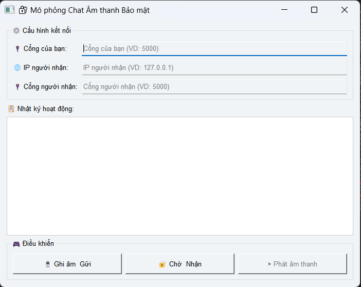

<h align="center">Ứng dụng bảo mật tin nhắn âm thanh với mã hoá DES và xác thực RSA\</h2>

<body>

    <h1>🔐 Ứng dụng Chat Âm thanh Bảo mật</h1>
    <h2>Giới thiệu</h2>
    

        Đây là ứng dụng mô phỏng hệ thống chat âm thanh bảo mật giữa hai máy tính, sử dụng các kỹ thuật mã hóa hiện đại (RSA, DES, SHA-256, chữ ký số) để đảm bảo an toàn và xác thực dữ liệu truyền tải.
    

<h2>Cách hoạt động</h2>
    <ol>
        <li class="step"><b>Ghi âm & gửi âm thanh:</b> Người gửi ghi âm một đoạn âm thanh, sau đó mã hóa và gửi đi.</li>
        <li class="step"><b>Trao đổi khóa an toàn:</b> Ứng dụng sử dụng RSA để trao đổi khóa bí mật (DES key) giữa hai bên.</li>
        <li class="step"><b>Mã hóa & ký số:</b> Đoạn âm thanh được mã hóa bằng DES, ký số và gửi kèm giá trị hash để đảm bảo toàn vẹn và xác thực nguồn gửi.</li>
        <li class="step"><b>Nhận & giải mã:</b> Người nhận kiểm tra chữ ký, giải mã khóa DES, kiểm tra toàn vẹn dữ liệu, sau đó giải mã và phát lại âm thanh.</li>
        <li class="step"><b>Giao tiếp mạng:</b> Hai bên giao tiếp qua socket TCP, gửi/nhận dữ liệu dạng JSON an toàn.</li>
    </ol>

<h2>Hướng dẫn sử dụng</h2>
    <ol>
        <li class="step"><b>Khởi tạo khóa:</b> Chạy file <code>generate_keys.py</code> để tạo cặp khóa RSA cho người gửi và người nhận.</li>
        <li class="step"><b>Chạy ứng dụng:</b> Mở file <code>gui.py</code> trên cả hai máy (hoặc hai cửa sổ).</li>
        <li class="step"><b>Cấu hình kết nối:</b>
            <ul>
                <li>Nhập <b>Cổng của bạn</b> (ví dụ: 5000).</li>
                <li>Nhập <b>IP người nhận</b> và <b>Cổng người nhận</b> (ví dụ: 127.0.0.1, 5000).</li>
            </ul>
        </li>
        <li class="step"><b>Gửi âm thanh:</b> 
            <ul>
                <li>Người nhận nhấn <b>Chờ & Nhận</b> để lắng nghe kết nối.</li>
                <li>Người gửi nhấn <b>Ghi âm & Gửi</b> để ghi âm và gửi tin nhắn âm thanh.</li>
            </ul>
        </li>
        <li class="step"><b>Nghe lại:</b> Sau khi nhận thành công, nhấn <b>Phát âm thanh</b> để nghe lại tin nhắn.</li>
    </ol>
    

        <b>Lưu ý:</b> Ứng dụng phù hợp cho mục đích học tập, nghiên cứu về bảo mật thông tin và truyền thông an toàn.
    

</body>
